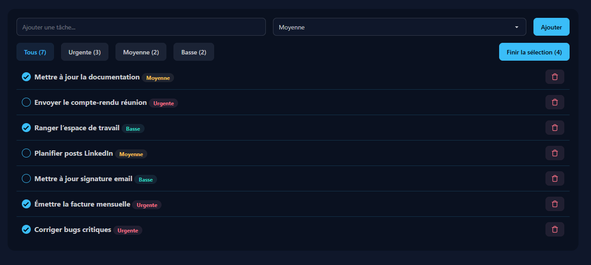
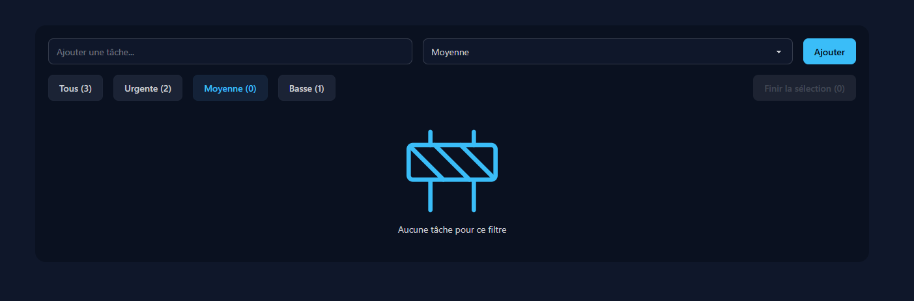

# Todo React App 📝

Application de gestion de tâches développée avec **React**, **TypeScript** et **Vite**.  
Elle permet d’ajouter, filtrer, sélectionner et supprimer des tâches avec persistance locale.

---

## 🚀 Fonctionnalités

- ➕ Ajouter une tâche avec priorité
- 🎯 Priorités : Urgente / Moyenne / Basse
- 🔍 Filtres par priorité + compteur
- ✅ Sélection multiple de tâches
- 🗑 Suppression individuelle ou par sélection
- 💾 Sauvegarde automatique via `localStorage`
- 🧱 Interface responsive (Tailwind / DaisyUI)

---

## 🛠️ Stack technique

- **React**
- **TypeScript**
- **Vite**
- **Tailwind CSS**
- **DaisyUI**
- **Lucide Icons**
- **Docker**

---

## 📦 Installation (local)

### Prérequis
- Node.js ≥ 20
- npm

```bash
npm install
npm run dev
```

Application accessible sur :

http://localhost:5173

## Lancer avec Docker (dev)

### Build de l’image
docker build -t todo-react .

Lancer le container
docker run -p 5173:5173 todo-react


Puis ouvrir :

http://localhost:5173


ℹ️ Le serveur Vite tourne en mode développement dans le container.

 ## 📌 Améliorations possibles

-Mode “terminé”

-Drag & drop

-Stockage backend

-Docker Compose (front + API)

## 📸 Screenshots

**Vue principale – liste des tâches**


**Filtrage par priorité (aucune tâche)**


